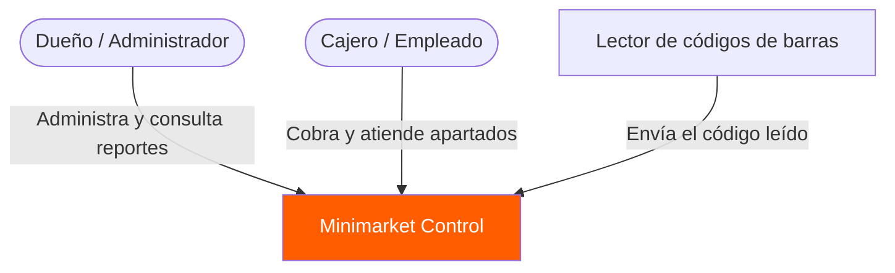
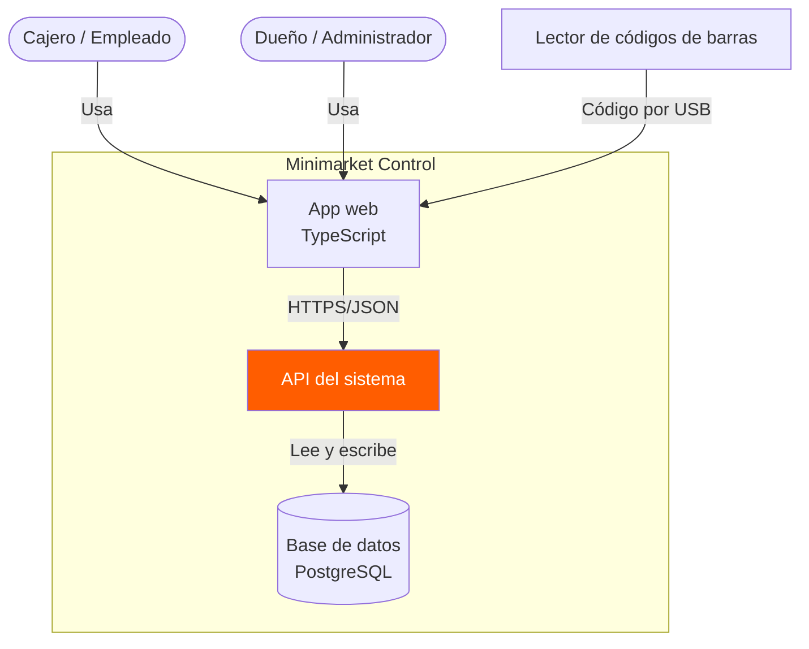
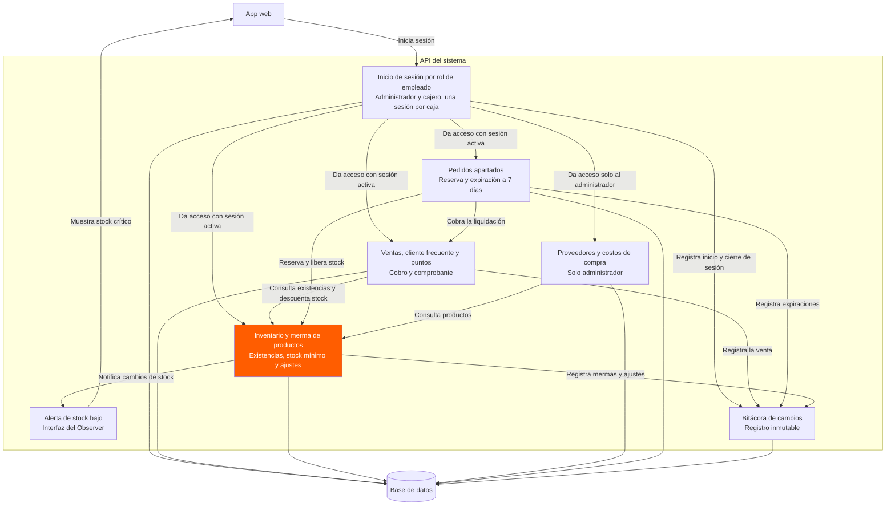

# Diagramas de arquitectura: Minimarket Control

## Diagrama 1: Contexto

```mermaid
flowchart TD
    admin(["Dueño / Administrador"])
    cajero(["Cajero / Empleado"])
    sis["Minimarket Control"]
    lector["Lector de códigos de barras"]

    admin -->|Administra y consulta reportes| sis
    cajero -->|Cobra y atiende apartados| sis
    lector -->|Envía el código leído| sis

    style sis fill:#ff5d00,color:#fff
```

## Diagrama 2: Contenedores

```mermaid
flowchart TD
    admin(["Dueño / Administrador"])
    cajero(["Cajero / Empleado"])

    subgraph sistema["Minimarket Control"]
        web["App web<br/>TypeScript"]
        api["API del sistema"]
        db[("Base de datos<br/>PostgreSQL")]
    end

    lector["Lector de códigos de barras"]

    cajero -->|Usa| web
    admin -->|Usa| web
    web -->|HTTPS/JSON| api
    api -->|Lee y escribe| db
    lector -->|Código por USB| web

    style api fill:#ff5d00,color:#fff
```

## Diagrama 3: Componentes de la API (monolito modular)

```mermaid
flowchart TD
    web["App web"]

    subgraph api["API del sistema"]
        aut["Inicio de sesión por rol de empleado<br/>Administrador y cajero, una sesión por caja"]
        pos["Ventas, cliente frecuente y puntos<br/>Cobro y comprobante"]
        inv["Inventario y merma de productos<br/>Existencias, stock mínimo y ajustes"]
        prov["Proveedores y costos de compra<br/>Solo administrador"]
        apart["Pedidos apartados<br/>Reserva y expiración a 7 días"]
        alert["Alerta de stock bajo<br/>Interfaz del Observer"]
        aud["Bitácora de cambios<br/>Registro inmutable"]
    end

    db[("Base de datos")]

    web -->|Inicia sesión| aut

    aut -->|Da acceso con sesión activa| pos
    aut -->|Da acceso con sesión activa| inv
    aut -->|Da acceso con sesión activa| apart
    aut -->|Da acceso solo al administrador| prov
    aut -->|Registra inicio y cierre de sesión| aud

    pos -->|Consulta existencias y descuenta stock| inv
    pos -->|Registra la venta| aud
    apart -->|Reserva y libera stock| inv
    apart -->|Cobra la liquidación| pos
    apart -->|Registra expiraciones| aud
    inv -->|Notifica cambios de stock| alert
    inv -->|Registra mermas y ajustes| aud
    alert -->|Muestra stock crítico| web
    prov -->|Consulta productos| inv

    aut --> db
    pos --> db
    inv --> db
    prov --> db
    apart --> db
    aud --> db

    style inv fill:#ff5d00,color:#fff
```
