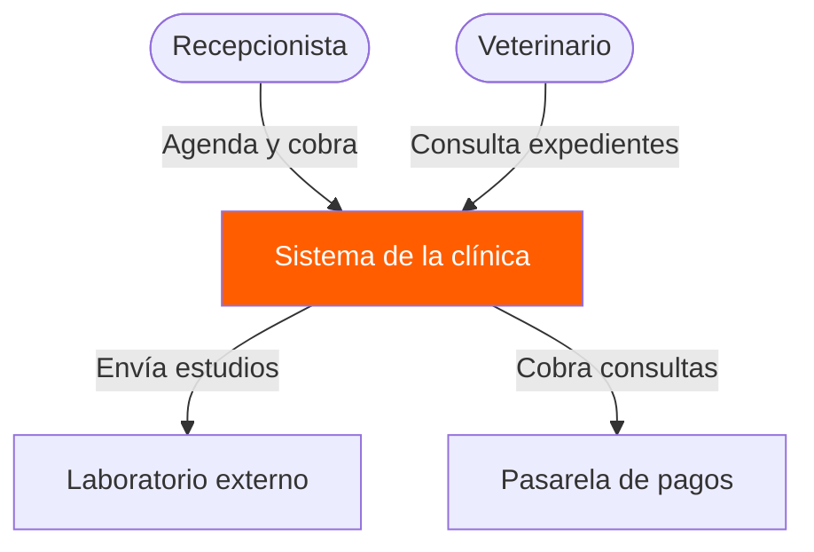
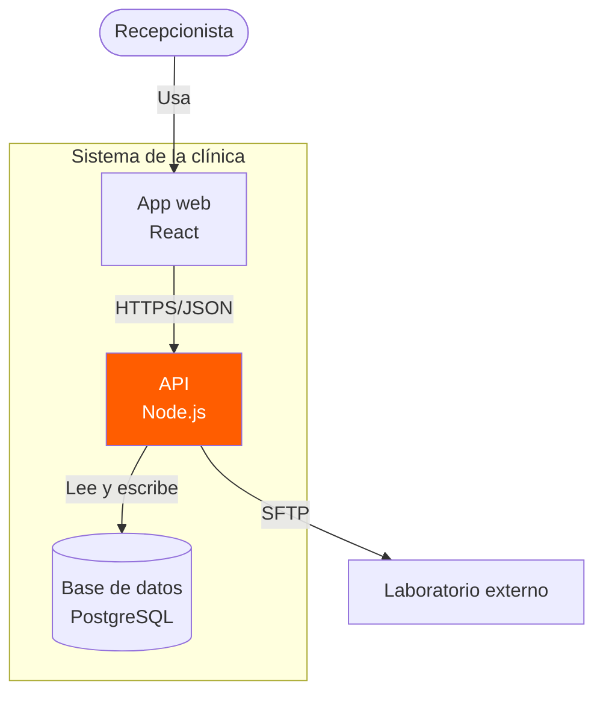
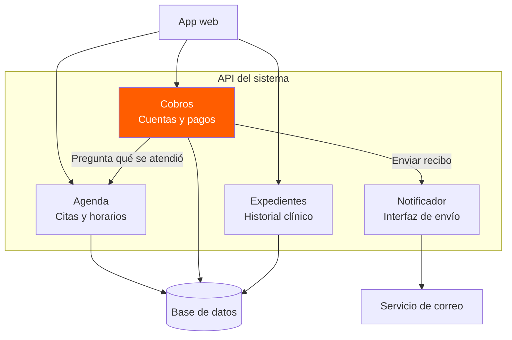
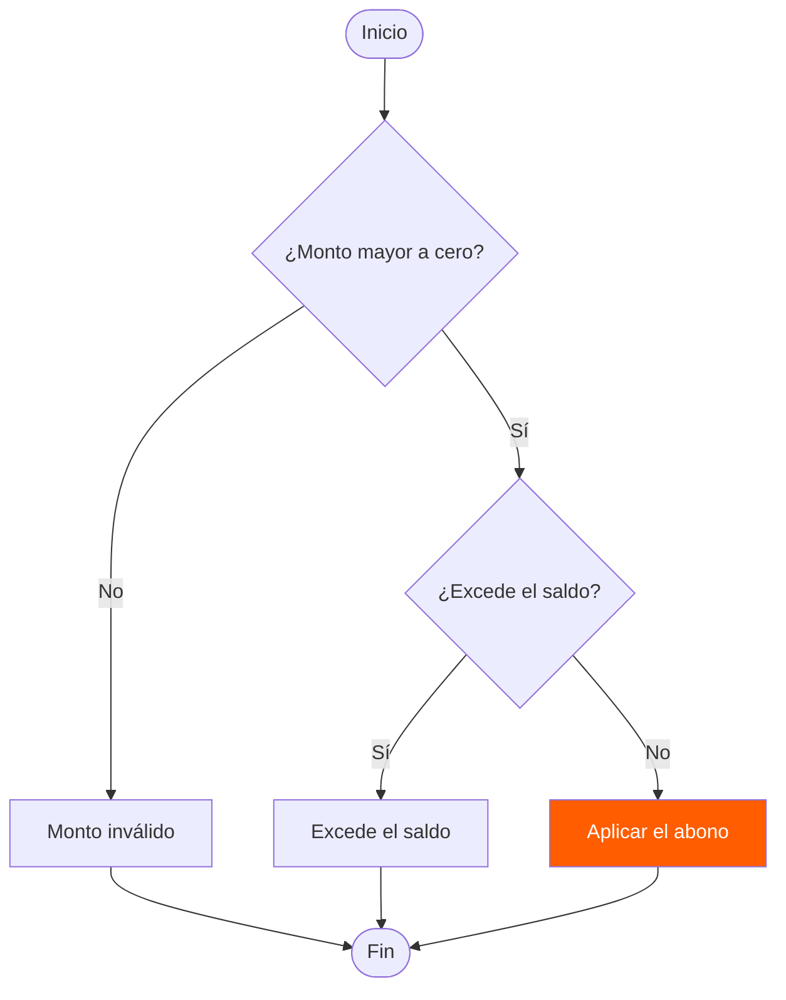
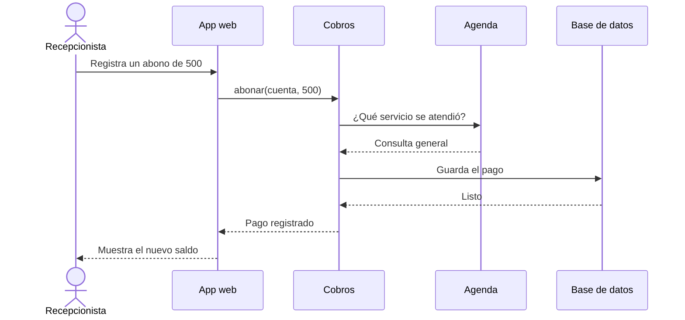
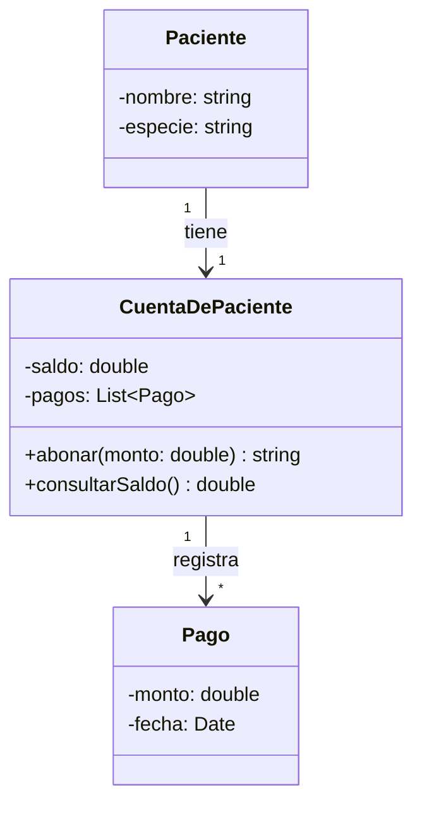
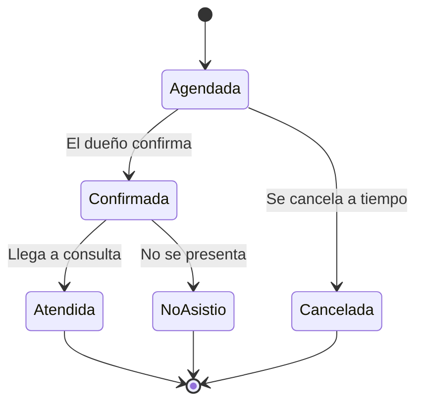
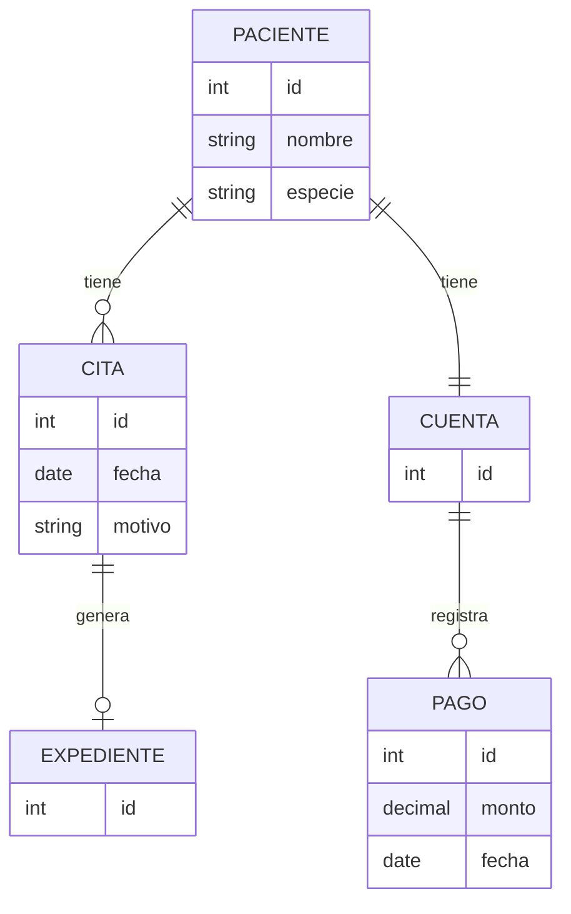

# Diagramas

## Diagrama 1

```mermaid
flowchart TD
    rec([Recepcionista])
    vet([Veterinario])
    sis["Sistema de la clínica"]
    lab["Laboratorio externo"]
    pago["Pasarela de pagos"]

    rec -->|Agenda y cobra| sis
    vet -->|Consulta expedientes| sis
    sis -->|Envía estudios| lab
    sis -->|Cobra consultas| pago

    style sis fill:#ff5d00,color:#fff
```

## Diagrama 2

```mermaid
flowchart TD
    rec([Recepcionista])

    subgraph sistema["Sistema de la clínica"]
        web["App web<br/>React"]
        api["API<br/>Node.js"]
        db[("Base de datos<br/>PostgreSQL")]
    end

    lab["Laboratorio externo"]

    rec -->|Usa| web
    web -->|HTTPS/JSON| api
    api -->|Lee y escribe| db
    api -->|SFTP| lab

    style api fill:#ff5d00,color:#fff
```

## Diagrama 3

```mermaid
flowchart TD
    web["App web"]

    subgraph api["API del sistema"]
        agenda["Agenda<br/>Citas y horarios"]
        cobros["Cobros<br/>Cuentas y pagos"]
        exp["Expedientes<br/>Historial clínico"]
        notif["Notificador<br/>Interfaz de envío"]
    end

    db[("Base de datos")]
    correo["Servicio de correo"]

    web --> agenda
    web --> cobros
    web --> exp

    cobros -->|Pregunta qué se atendió| agenda
    cobros -->|Enviar recibo| notif
    notif --> correo

    agenda --> db
    cobros --> db
    exp --> db

    style cobros fill:#ff5d00,color:#fff
```

## Diagrama 4

```mermaid
flowchart TD
    ini([Inicio])
    val{"¿Monto mayor a cero?"}
    exc{"¿Excede el saldo?"}
    apl["Aplicar el abono"]
    err1["Monto inválido"]
    err2["Excede el saldo"]
    fin([Fin])

    ini --> val
    val -->|No| err1
    val -->|Sí| exc

    exc -->|Sí| err2
    exc -->|No| apl

    err1 --> fin
    err2 --> fin
    apl --> fin

    style apl fill:#ff5d00,color:#fff
```

## Diagrama 5

```mermaid
sequenceDiagram
    actor Rec as Recepcionista
    participant Web as App web
    participant Cob as Cobros
    participant Age as Agenda
    participant BD as Base de datos

    Rec->>Web: Registra un abono de 500
    Web->>Cob: abonar(cuenta, 500)
    Cob->>Age: ¿Qué servicio se atendió?
    Age-->>Cob: Consulta general
    Cob->>BD: Guarda el pago
    BD-->>Cob: Listo
    Cob-->>Web: Pago registrado
    Web-->>Rec: Muestra el nuevo saldo
```

## Diagrama 6

```mermaid
classDiagram
    class CuentaDePaciente {
        -saldo: double
        -pagos: List~Pago~
        +abonar(monto: double) string
        +consultarSaldo() double
    }

    class Pago {
        -monto: double
        -fecha: Date
    }

    class Paciente {
        -nombre: string
        -especie: string
    }

    Paciente "1" --> "1" CuentaDePaciente : tiene
    CuentaDePaciente "1" --> "*" Pago : registra
```

## Diagrama 7

```mermaid
stateDiagram-v2
    [*] --> Agendada

    Agendada --> Confirmada: El dueño confirma
    Agendada --> Cancelada: Se cancela a tiempo

    Confirmada --> Atendida: Llega a consulta
    Confirmada --> NoAsistio: No se presenta

    Atendida --> [*]
    Cancelada --> [*]
    NoAsistio --> [*]
```

## Diagrama 8

```mermaid
erDiagram
    PACIENTE ||--o{ CITA : tiene
    PACIENTE ||--|| CUENTA : tiene
    CITA ||--o| EXPEDIENTE : genera
    CUENTA ||--o{ PAGO : registra

    PACIENTE {
        int id
        string nombre
        string especie
    }

    CITA {
        int id
        date fecha
        string motivo
    }

    CUENTA {
        int id
    }

    EXPEDIENTE {
        int id
    }

    PAGO {
        int id
        decimal monto
        date fecha
    }
```
